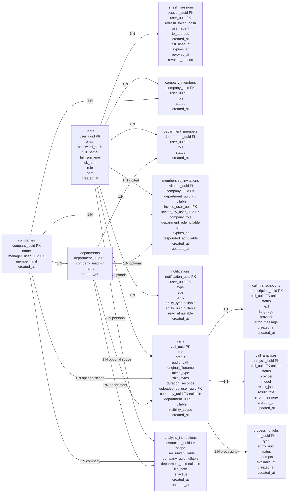
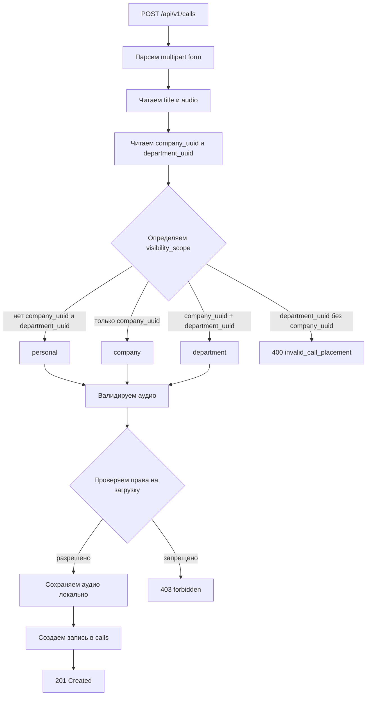
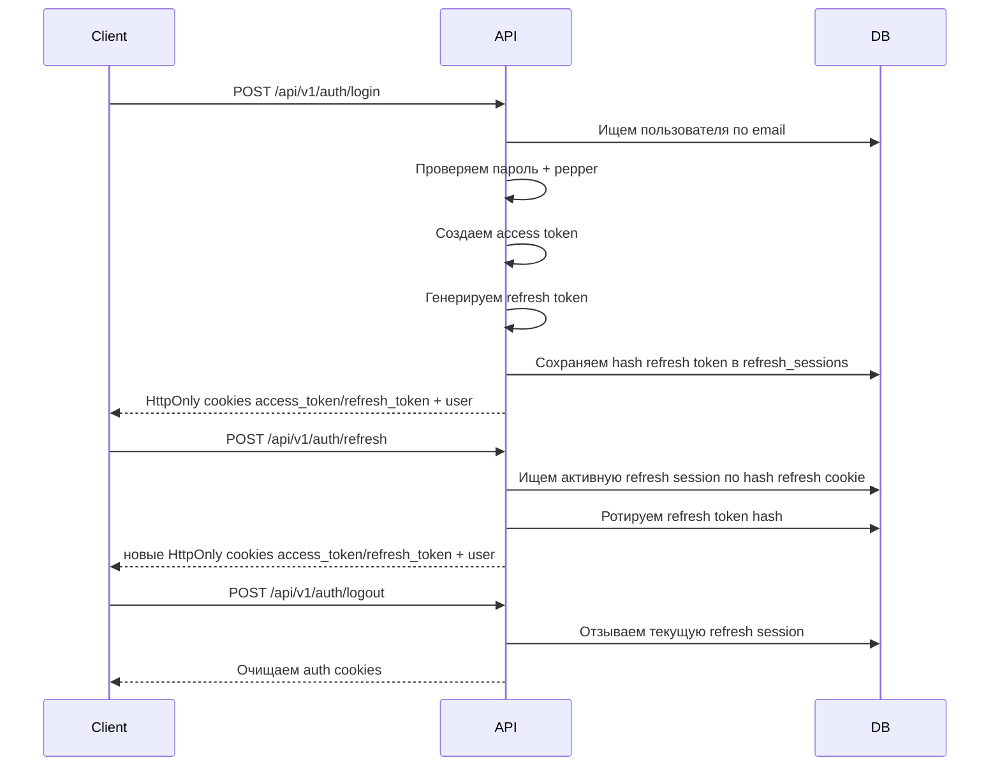

# CallLens Monolith

CallLens - backend-монолит на Go для будущего продукта, который хранит записи звонков продаж/поддержки, транскрибирует аудио и сохраняет результат анализа звонка.

На текущем этапе проект реализует авторизацию, локальную загрузку и хранение аудио, права доступа к звонкам, структуру компаний/отделов, управление участниками, фоновые задания транскрибации, инструкции анализа и mock-анализ звонков по готовой транскрипции.

## Стек

- Go 1.25.7
- PostgreSQL 16
- chi router
- goose migrations
- JWT access tokens
- Refresh sessions в PostgreSQL
- Локальное хранение аудио на файловой системе
- Локальное хранение markdown-инструкций анализа на файловой системе
- Структурированный logger на базе zap
- Docker Compose для локального PostgreSQL

## Текущее состояние

Реализовано:

- Регистрация пользователя.
- Логин пользователя.
- Валидация access token.
- Refresh token rotation.
- Logout и logout-all через отзыв refresh session.
- Ручка текущего пользователя.
- Загрузка звонка с аудиофайлом.
- Проверка типа аудиофайла.
- Определение длительности аудио через `ffprobe`.
- Локальное сохранение аудио.
- Список/получение/скачивание аудио/получение транскрипции/обновление title/удаление звонка.
- Очередь `processing_jobs` и worker для фоновой транскрибации и анализа.
- Абстракция transcriber с mock-провайдером, OpenRouter-провайдером и factory-заглушкой для OpenAI.
- Сохранение транскрипций звонков в `call_transcriptions`.
- Управление markdown-инструкциями анализа для личного, корпоративного и отделского scope.
- Абстракция analyzer с mock-провайдером, OpenRouter-провайдером и factory-заглушкой для OpenAI.
- Асинхронный анализ звонка по готовой транскрипции и инструкциям через `processing_jobs`.
- Ручной запуск анализа через HTTP-ручку по готовой транскрипции.
- Сохранение анализа звонка в `call_analyses`.
- Создание компании.
- Создание отдела.
- Управление участниками компании и отдела.
- Приглашения в компанию и отдел с подтверждением пользователем.
- Глобальный поиск по видимым звонкам, компаниям, отчетам и инструкциям.
- Уведомления для bell с read/unread API; автоматическое создание подключено для invitation-событий.
- Ролевая модель доступа к загрузке и просмотру звонков.
- Единый JSON-формат ошибок API.
- Логирование запросов.
- Recovery middleware через общий logger.

Пока не реализовано:

- Реальные OpenAI-провайдеры для transcriber и analyzer.
- Асинхронная очередь для анализа звонков.
- Frontend.
- Оплата и тарифы.
- Email-приглашения.
- Сброс пароля.
- Передача управления компанией другому пользователю.
- Production deploy-конфигурация.

## Основные сущности



## Роли и статусы

Роли в компании:

- `company_manager` - управляющий компанией. Может управлять участниками, отделами и доступом на уровне компании.
- `employee` - обычный участник компании.

Роли в отделе:

- `department_leader` - лидер/руководитель отдела.
- `employee` - обычный участник отдела.

Статусы участников:

- `active`
- `suspended`
- `left`

В проекте для участников используется изменение статуса, а не физическое удаление строки из БД. Это позволяет сохранить историю членства.

Статусы приглашений:

- `pending`
- `accepted`
- `declined`
- `canceled`
- `expired`

## Видимость звонков

У звонка есть поле `visibility_scope`:

- `personal`
- `company`
- `department`

Статусы обработки звонка:

- `new` - звонок сохранён и ожидает обработки.
- `processing` - обработчик забрал звонок в работу.
- `transcribed` - аудио переведено в текст.
- `analyzed` - по транскрипту построен анализ.
- `failed` - обработка завершилась ошибкой.

`new` используется как состояние очереди. Worker забирает задания `transcribe_call`, переводит звонок в `processing`, сохраняет транскрипцию, переводит звонок в `transcribed` и ставит в очередь задание `analyze_call`. Задание анализа загружает готовую транскрипцию, выбирает подходящие инструкции, сохраняет результат в `call_analyses` и при успехе переводит звонок в `analyzed`. HTTP-ручка анализа ставит `analyze_call` job для ручного запуска по готовой транскрипции.

Статусы транскрипции:

- `processing`
- `transcribed`
- `failed`

Статусы анализа:

- `pending`
- `processing`
- `done`
- `failed`

Правила целостности в БД:

- `personal`: `company_uuid` и `department_uuid` должны быть `NULL`.
- `company`: `company_uuid` должен быть заполнен, `department_uuid` должен быть `NULL`.
- `department`: должны быть заполнены и `company_uuid`, и `department_uuid`.

Правила просмотра:

- Пользователь видит звонки, которые сам загрузил.
- `company_manager` видит все звонки своей компании.
- `department_leader` видит звонки своего отдела.
- `employee` видит только свои звонки.

Правила загрузки:

- Любой авторизованный пользователь может загрузить личный звонок.
- Только `company_manager` может загрузить звонок на уровне компании.
- `company_manager`, `department_leader` и `employee` целевого отдела могут загрузить звонок на уровне отдела.



## Авторизация



## Управление участниками

Реализованные операции:

- Добавить участника компании.
- Добавить участника отдела.
- Создать приглашение в компанию.
- Создать приглашение в отдел.
- Получить входящие приглашения текущего пользователя.
- Принять или отклонить приглашение.
- Отменить pending-приглашение.
- Получить структурированный обзор участников компании.
- Получить агрегированный analytics overview по видимым звонкам.
- Получить monitoring summary очереди обработки для admin/superadmin или manager своей компании.
- Получить участников отдела.
- Изменить роль участника компании.
- Изменить статус участника компании.
- Изменить роль участника отдела.
- Изменить статус участника отдела.

Структурированный обзор компании возвращает данные в удобном для frontend виде:

```json
{
  "company_uuid": "...",
  "manager": {
    "company_uuid": "...",
    "user_uuid": "...",
    "role": "company_manager",
    "status": "active",
    "created_at": "..."
  },
  "company_employees": [],
  "departments": [
    {
      "department": {
        "id": "...",
        "company_uuid": "...",
        "name": "Sales",
        "created_at": "..."
      },
      "members": []
    }
  ]
}
```

### Приглашения

Новый flow приглашений не удаляет старые прямые ручки добавления участников. Pending-приглашение не создает `active` membership и не дает доступ к компании или отделу. Пользователь становится активным участником только после `accept`.

Прямое добавление участника отдела доступно `company_manager`; `department_leader` может добавить в свой отдел только уже активного участника компании и только как `employee`.

Права:

- `company_manager` может приглашать пользователя в компанию только как `employee`.
- `company_manager` может приглашать активного участника компании в любой отдел как `employee` или `department_leader`.
- `department_leader` может приглашать только в свой отдел и только как `employee`.

Для MVP выбран консервативный вариант department-invite: лидер отдела может приглашать в отдел только уже активного участника компании. Такой accept не создает `company_members`, поэтому не расширяет права лидера отдела до ввода новых людей в компанию.

Если пользователь был `left` или `suspended` в компании, принятие company-invite реактивирует запись в `company_members` со статусом `active`. Лимит участников компании проверяется на `accept`, а pending invitation не занимает место в лимите.

## API

Базовый путь:

```text
/api/v1
```

Health:

| Method | Path | Auth | Описание |
| --- | --- | --- | --- |
| GET | `/health` | Нет | Проверка состояния API |

Auth:

| Method | Path | Auth | Описание |
| --- | --- | --- | --- |
| POST | `/api/v1/auth/register` | Нет | Регистрация пользователя |
| POST | `/api/v1/auth/login` | Нет | Логин, создание refresh session и установка auth cookies |
| POST | `/api/v1/auth/refresh` | Нет | Ротация refresh token из cookie |
| GET | `/api/v1/auth/me` | Да | Получить текущего пользователя |
| PATCH | `/api/v1/auth/me/password` | Да | Сменить пароль текущего пользователя |
| GET | `/api/v1/auth/me/sessions` | Да | Получить активные refresh session текущего пользователя |
| DELETE | `/api/v1/auth/me/sessions/{session_uuid}` | Да | Отозвать одну свою refresh session |
| PATCH | `/api/v1/auth/me/profile` | Да | Частично обновить профиль пользователя |
| POST | `/api/v1/auth/me/avatar` | Да | Загрузить avatar через multipart field `avatar` |
| DELETE | `/api/v1/auth/me/avatar` | Да | Сбросить avatar к буквенной заглушке |
| GET | `/api/v1/auth/me/preferences` | Да | Получить UI preferences пользователя |
| PATCH | `/api/v1/auth/me/preferences` | Да | Частично обновить UI preferences пользователя |
| POST | `/api/v1/auth/logout` | Да | Отозвать текущую session |
| POST | `/api/v1/auth/logout-all` | Да | Отозвать все session пользователя |

`PATCH /api/v1/auth/me/password` принимает:

```json
{
  "current_password": "old password",
  "new_password": "new strong password"
}
```

Backend проверяет текущий пароль, применяет действующее правило сложности пароля (минимум 8 символов), обновляет password hash и отзывает все refresh session пользователя, кроме текущей. Ответ:

```json
{
  "updated_at": "2026-07-02T10:00:00Z"
}
```

`GET /api/v1/auth/me/sessions` возвращает только активные, не истекшие refresh session текущего пользователя и не раскрывает raw refresh token или token hash:

```json
{
  "sessions": [
    {
      "id": "session_uuid",
      "current": true,
      "user_agent": "Chrome on Windows",
      "ip": "127.0.0.1/32",
      "created_at": "2026-07-02T10:00:00Z",
      "last_seen_at": "2026-07-02T12:00:00Z"
    }
  ]
}
```

`last_seen_at` сейчас отражает последнее refresh/rotation событие (`last_used_at`); если refresh еще не было, используется `created_at`. Middleware не обновляет это поле на каждый authenticated request, чтобы не добавлять запись в БД на каждый запрос.

`DELETE /api/v1/auth/me/sessions/{session_uuid}` отзывает только session текущего пользователя. Если удаляется текущая session, backend дополнительно очищает auth cookies. `POST /api/v1/auth/logout-all` сохранен и по-прежнему отзывает все refresh session пользователя.

`PATCH /api/v1/auth/me/profile` принимает частичный JSON с полями `full_name`, `full_surname`, `post`, `phone`, `timezone` и возвращает обновленный `UserResponse`. `timezone` проверяется через IANA timezone database, например `Europe/Moscow`.

`POST /api/v1/auth/me/avatar` принимает multipart upload в поле `avatar`, сохраняет image-файл в локальном storage и возвращает:

```json
{
  "avatar_url": "/api/v1/auth/me/avatar",
  "updated_at": "2026-07-02T10:00:00Z"
}
```

`PATCH /api/v1/auth/me/preferences` принимает частичный JSON с `active_company_uuid`, `theme` (`system`, `light`, `dark`) и `date_range.from` / `date_range.to` в формате `YYYY-MM-DD`. `active_company_uuid` разрешен только для компании, где текущий пользователь является активным участником.

Calls:

| Method | Path | Auth | Описание |
| --- | --- | --- | --- |
| POST | `/api/v1/calls` | Да | Загрузить аудио звонка |
| GET | `/api/v1/calls` | Да | Получить список видимых звонков |
| GET | `/api/v1/calls/filters` | Да | Получить справочник фильтров для списка звонков |
| GET | `/api/v1/calls/{uuid}` | Да | Получить видимый звонок по UUID |
| GET | `/api/v1/calls/{uuid}/audio` | Да | Получить аудиофайл звонка |
| GET | `/api/v1/calls/{uuid}/transcription` | Да | Получить сохраненную транскрипцию звонка |
| POST | `/api/v1/calls/{uuid}/analysis` | Да | Поставить `analyze_call` job по готовой транскрипции |
| GET | `/api/v1/calls/{uuid}/analysis` | Да | Получить сохраненный анализ звонка |
| POST | `/api/v1/calls/{uuid}/reports` | Да | Создать отчет по одному видимому звонку |
| GET | `/api/v1/calls/{uuid}/reports` | Да | Получить отчеты одного видимого звонка |
| GET | `/api/v1/reports` | Да | Получить глобальный список отчетов по видимым звонкам |
| POST | `/api/v1/reports` | Да | Создать отчет из глобальной страницы |
| GET | `/api/v1/reports/{report_uuid}/download` | Да | Скачать готовый отчет |
| DELETE | `/api/v1/reports/{report_uuid}` | Да | Удалить отчет |
| PATCH | `/api/v1/calls/{uuid}` | Да | Обновить title звонка |
| DELETE | `/api/v1/calls/{uuid}` | Да | Удалить звонок и аудиофайл |

`GET /api/v1/calls` без query-параметров сохраняет старую форму ответа и возвращает массив `CallResponse`.

`CallResponse` содержит URL аудиопотока для браузерного плеера:

```json
{
  "id": "call_uuid",
  "audio_url": "/api/v1/calls/{uuid}/audio"
}
```

`GET /api/v1/calls/{uuid}/audio`:

- требует авторизацию;
- доступен только если текущему пользователю виден сам звонок;
- возвращает бинарный stream с `Content-Disposition: inline`;
- использует сохраненный `mime_type` как `Content-Type`, если он известен;
- поддерживает `Range` и `Accept-Ranges: bytes` для перемотки HTML `<audio>` плеера;
- возвращает `404 call_not_found`, если звонка нет или он не видим;
- возвращает `410 audio_file_not_found`, если запись звонка существует, но аудиофайл физически недоступен.

Если передан хотя бы один фильтр или параметр пагинации, ответ возвращается в envelope:

```json
{
  "items": [{ "...": "CallResponse" }],
  "total": 42,
  "limit": 20,
  "offset": 0
}
```

Поддерживаемые query-параметры:

| Параметр | Значение |
| --- | --- |
| `q` | Поиск по `title` и `original_filename` |
| `status` | `new`, `processing`, `transcribed`, `analyzed`, `failed` |
| `scope` | `personal`, `company`, `department` |
| `company_uuid` | UUID компании |
| `department_uuid` | UUID отдела |
| `uploaded_by_user_uuid` | UUID пользователя, загрузившего звонок |
| `from` | ISO date/datetime, нижняя граница `created_at` |
| `to` | ISO date/datetime, верхняя граница `created_at`; дата `YYYY-MM-DD` считается до конца этого дня |
| `limit` | 1..100; по умолчанию 20 для filtered/envelope-ответа |
| `offset` | 0 или больше; по умолчанию 0 |

Все фильтры применяются только поверх видимых текущему пользователю звонков.

Дополнительно `GET /api/v1/calls` принимает `folder_uuid`. Фильтр возвращает только видимые текущему пользователю звонки, назначенные в активную папку. Доступ к самой папке проверяется отдельно; чужая или удаленная папка не должна раскрывать скрытые звонки.

`GET /api/v1/calls/filters` принимает optional `company_uuid` и `department_uuid` и возвращает:

```json
{
  "statuses": ["new", "processing", "transcribed", "analyzed", "failed"],
  "scopes": ["personal", "company", "department"],
  "managers": [
    {
      "id": "user_uuid",
      "full_name": "Ivan",
      "full_surname": "Petrov",
      "username": "petrov"
    }
  ]
}
```

Поле `managers` в справочнике содержит компактный список пользователей, которые загрузили видимые текущему пользователю звонки в выбранном scope компании/отдела. Название поля сохранено для frontend-контракта фильтров.

Call folders:

Папки звонков группируют звонки по теме или рабочей области для последующей фильтрации списка и analytics. Папка не является `analysis_instruction`: инструкция отвечает на вопрос "как анализировать", а папка отвечает на вопрос "к какой группе относится звонок".

| Method | Path | Auth | Описание |
| --- | --- | --- | --- |
| GET | `/api/v1/call-folders` | Да | Получить видимые папки с `calls_count` |
| POST | `/api/v1/call-folders` | Да | Создать папку |
| GET | `/api/v1/call-folders/{folder_uuid}` | Да | Получить одну видимую папку |
| PATCH | `/api/v1/call-folders/{folder_uuid}` | Да | Обновить `name`, `description`, `color` |
| DELETE | `/api/v1/call-folders/{folder_uuid}` | Да | Soft-delete папки через `deleted_at` |
| GET | `/api/v1/call-folders/{folder_uuid}/calls` | Да | Получить звонки папки в форме `{ items, total, limit, offset }` |
| POST | `/api/v1/call-folders/{folder_uuid}/calls` | Да | Идемпотентно назначить звонок в папку |
| DELETE | `/api/v1/call-folders/{folder_uuid}/calls/{call_uuid}` | Да | Убрать звонок из папки |

`GET /api/v1/call-folders` принимает `scope=personal|company|department`, `company_uuid`, `department_uuid`, `q`, `limit`, `offset`. `limit` по умолчанию `20`, максимум `100`. Для `company` нужен `company_uuid`; для `department` нужны `company_uuid` и `department_uuid`; для `personal` `company_uuid` и `department_uuid` не передаются.

Пример `CallFolderResponse`:

```json
{
  "id": "folder_uuid",
  "scope": "personal",
  "user_uuid": "user_uuid",
  "company_uuid": null,
  "department_uuid": null,
  "name": "Возражения по цене",
  "description": "Звонки, где клиент сомневался из-за цены",
  "color": "#3b82f6",
  "calls_count": 12,
  "created_by_user_uuid": "user_uuid",
  "created_at": "2026-07-05T10:00:00Z",
  "updated_at": "2026-07-05T10:00:00Z"
}
```

Права:

- `personal`: владелец создает, читает, обновляет, удаляет и назначает только свои personal-звонки.
- `company`: управляет только активный `company_manager`; читать может активный `company_manager` или активный участник компании, который состоит хотя бы в одном видимом отделе.
- `department`: управляет активный `company_manager` или активный `department_leader` этого отдела; читать может активный `company_manager` или активный участник этого отдела.

Назначение звонка проверяет совпадение scope: personal-папка принимает только personal-звонок владельца, company-папка только звонки этой компании, department-папка только звонки этой компании и отдела. Несовпадение возвращает `400 call_folder_scope_mismatch`. Удаленная папка не возвращается в списках и не принимает новые назначения. `GET /api/v1/calls/filters` пока не возвращает список папок.

Reports:

`POST /api/v1/calls/{uuid}/reports` и `POST /api/v1/reports` с `scope=call` используют один и тот же генератор отчета по звонку. Поддерживаемые форматы: `pdf`, `docx`, `md`, `xlsx`. Для `scope=company`, `department`, `manager`, `period` API возвращает `501 not_implemented`, пока в backend нет реального агрегированного генератора.

Analytics and monitoring:

| Method | Path | Auth | Описание |
| --- | --- | --- | --- |
| GET | `/api/v1/analytics/overview` | Да | KPI summary по видимым текущему пользователю звонкам |
| GET | `/api/v1/monitoring/processing` | Да | Summary очереди обработки для `admin`/`superadmin` или `company_manager` своей компании |

Search:

| Method | Path | Auth | Описание |
| --- | --- | --- | --- |
| GET | `/api/v1/search` | Да | Глобальный поиск по видимым calls, companies, reports, instructions |

`GET /api/v1/search` принимает обязательный `q`, optional `types=calls,companies,reports,instructions` и optional `limit`. Пустой или слишком короткий `q` возвращает `400 invalid_search_input`. Поиск не обращается к CRM-клиентам, потому что таких сущностей в backend-контракте нет.

Ответ:

```json
{
  "calls": [
    {
      "id": "call_uuid",
      "title": "Обсуждение условий",
      "status": "analyzed",
      "created_at": "2026-07-02T10:00:00Z"
    }
  ],
  "companies": [
    {
      "id": "company_uuid",
      "name": "CallLens Test Company"
    }
  ],
  "reports": [
    {
      "id": "report_uuid",
      "call_uuid": "call_uuid",
      "file_name": "report.pdf",
      "status": "ready"
    }
  ],
  "instructions": [
    {
      "id": "instruction_uuid",
      "title": "Инструкция продаж",
      "scope": "company"
    }
  ]
}
```

Notifications:

| Method | Path | Auth | Описание |
| --- | --- | --- | --- |
| GET | `/api/v1/notifications` | Да | Получить уведомления текущего пользователя |
| POST | `/api/v1/notifications/{uuid}/read` | Да | Отметить одно свое уведомление прочитанным |
| POST | `/api/v1/notifications/read-all` | Да | Отметить все свои уведомления прочитанными |

`GET /api/v1/notifications` принимает `unread_only=true|false`, `limit`, `offset` и возвращает `unread_count` по текущему пользователю. Сейчас backend реально создает notification типа `invitation` при создании company/department invitation. Типы `report_ready`, `subscription`, `processing_failed` закреплены в БД и service API для подключения будущих потоков, но статические события для них не имитируются.

Ответ:

```json
{
  "notifications": [
    {
      "id": "notification_uuid",
      "type": "invitation",
      "title": "Новое приглашение",
      "body": "Вам отправили приглашение в CallLens",
      "entity_type": "invitation",
      "entity_uuid": "invitation_uuid",
      "read_at": null,
      "created_at": "2026-07-02T10:00:00Z"
    }
  ],
  "unread_count": 1
}
```

`GET /api/v1/analytics/overview` принимает query-параметры:

| Параметр | Значение |
| --- | --- |
| `from` | ISO date/datetime, нижняя граница `calls.created_at` |
| `to` | ISO date/datetime, верхняя граница `calls.created_at`; дата `YYYY-MM-DD` считается до конца этого дня |
| `scope` | `personal`, `company`, `department` |
| `company_uuid` | UUID компании |
| `department_uuid` | UUID отдела |
| `folder_uuid` | UUID активной видимой папки звонков |

Все analytics-фильтры применяются только поверх звонков, которые видны текущему пользователю по общей модели видимости. `folder_uuid` дополнительно ограничивает выборку звонками, назначенными в видимую активную папку, и не обходит проверку видимости самих звонков. Backend считает `calls_total`, breakdown по статусам и `average_duration_seconds` SQL-агрегацией, а quality/topics/risks/recommendations и free analytics v2 агрегирует из сохраненных `call_analyses.result_json`. Endpoint не вызывает AI и не запускает новый анализ.

Ответ:

```json
{
  "calls_total": 31,
  "calls_new": 2,
  "calls_processing": 1,
  "calls_transcribed": 8,
  "calls_analyzed": 20,
  "calls_failed": 0,
  "average_duration_seconds": 438,
  "average_quality_score": 4.3,
  "quality_score_scale": 5,
  "average_score": 86.4,
  "score_scale": 100,
  "score_distribution": {
    "critical": 1,
    "weak": 3,
    "normal": 8,
    "good": 10,
    "excellent": 4
  },
  "criteria_summary": [
    {
      "code": "needs_discovery",
      "title": "Выявление потребности",
      "average_score": 62.5,
      "met": 3,
      "partially_met": 4,
      "missed": 2,
      "unclear": 1,
      "not_applicable": 0,
      "calls_count": 10
    }
  ],
  "top_weak_criteria": [
    {
      "code": "needs_discovery",
      "title": "Выявление потребности",
      "average_score": 62.5,
      "missed_count": 2,
      "partially_met_count": 4
    }
  ],
  "top_issue_codes": [
    { "code": "weak_next_step", "count": 7 }
  ],
  "business_outcomes": [
    { "status": "follow_up_needed", "count": 8 }
  ],
  "next_step_summary": {
    "with_next_step": 12,
    "specific": 9,
    "with_deadline": 4,
    "with_responsible_person": 7,
    "missing": 5
  },
  "top_topics": [],
  "risks_count": null,
  "recommendations_count": null,
  "charts": {
    "calls_by_day": [
      { "date": "2026-07-01", "count": 4 }
    ],
    "analyzed_by_day": [
      { "date": "2026-07-01", "count": 3 }
    ],
    "quality_by_day": [
      { "date": "2026-07-01", "average_quality_score": 4.5 }
    ],
    "score_by_day": [
      { "date": "2026-07-01", "average_score": 90.0 }
    ],
    "duration_by_day": [
      { "date": "2026-07-01", "average_duration_seconds": 420 }
    ],
    "risks_by_day": [
      { "date": "2026-07-01", "count": 1 }
    ]
  }
}
```

`average_score` всегда возвращается в шкале 0..100, `score_scale` всегда равен `100`. Для совместимости `average_quality_score` и `quality_by_day` остаются в шкале 1..5 и считаются как `average_score / 20` с округлением до 1 знака. Score извлекается сначала из v2-пары `score` + `score_scale`, затем из legacy-полей `quality_score`, `overall_score`, `manager_score`, `score`.

`score_distribution` считает только analyzed calls с валидным `result_json`: `critical` = 0..49, `weak` = 50..64, `normal` = 65..79, `good` = 80..89, `excellent` = 90..100. `criteria_summary` и `top_weak_criteria` строятся из `criteria_results`; `not_applicable` учитывается в счетчике, но исключается из среднего score критерия. `top_issue_codes` строится из `issue_codes` с игнорированием пустых строк. `business_outcomes` использует `business_outcome.status`, неизвестные статусы попадают в `unclear`. `next_step_summary` использует `next_step_quality`, а если его нет, fallback смотрит `next_step` и `next_steps`.

`risks_count` использует `risks`, `customer_objections`, `manager_quality.issues`. `recommendations_count` использует `manager_quality.recommendations`, `next_steps`, `recommendations`. `top_topics` использует `topics` и `top_topics`. CRM-сущности, сделки, воронка продаж и клиентская база в analytics не добавляются.

`GET /api/v1/monitoring/processing` принимает query-параметры:

| Параметр | Значение |
| --- | --- |
| `company_uuid` | optional UUID компании |
| `from` | ISO date/datetime, нижняя граница `processing_jobs.created_at` |
| `to` | ISO date/datetime, верхняя граница `processing_jobs.created_at`; дата `YYYY-MM-DD` считается до конца этого дня |

Доступ:

- `admin` и `superadmin` могут смотреть общий monitoring; optional `company_uuid` ограничивает выборку компанией.
- `company_manager` может смотреть только свою компанию. Если `company_uuid` не передан, backend использует компанию, которой управляет текущий пользователь.
- Другие пользователи получают `403 forbidden`.

Ответ:

```json
{
  "queue": {
    "pending": 3,
    "running": 1,
    "done": 120,
    "failed": 2,
    "retry": 4
  },
  "average_processing_seconds": 52
}
```

`queue.retry` считается как `pending` jobs с `attempts > 0`. `average_processing_seconds` считается по завершенным (`done`) jobs как разница `updated_at - created_at`. Пользовательский endpoint не отдает `last_error`, storage paths, имена внутренних сервисов или другие raw processing details.

`POST /api/v1/reports`:

```json
{
  "format": "pdf",
  "scope": "call",
  "call_uuid": "call_uuid",
  "company_uuid": null,
  "department_uuid": null,
  "manager_user_uuid": null,
  "period_from": "2026-07-01T00:00:00Z",
  "period_to": "2026-07-31T23:59:59Z"
}
```

`GET /api/v1/reports` возвращает только отчеты по звонкам, которые видны текущему пользователю. Поддерживаемые query-параметры:

| Параметр | Значение |
| --- | --- |
| `format` | `pdf`, `docx`, `md`, `xlsx` |
| `status` | `pending`, `ready`, `failed` |
| `company_uuid` | UUID компании звонка |
| `department_uuid` | UUID отдела звонка |
| `call_uuid` | UUID звонка |
| `from` | ISO datetime, нижняя граница `created_at` отчета |
| `to` | ISO datetime, верхняя граница `created_at` отчета |
| `sort` | `created_at` или `updated_at`; по умолчанию `created_at` |
| `order` | `desc` или `asc`; по умолчанию `desc` |
| `limit` | 1..100; по умолчанию 20 |
| `offset` | 0 или больше; по умолчанию 0 |

Ответ:

```json
{
  "reports": [
    {
      "id": "report_uuid",
      "call_uuid": "call_uuid",
      "format": "pdf",
      "status": "ready",
      "download_url": "/api/v1/reports/report_uuid/download",
      "call": {
        "id": "call_uuid",
        "title": "Обсуждение условий договора",
        "status": "analyzed",
        "created_at": "2026-07-02T10:00:00Z",
        "company_uuid": "company_uuid",
        "department_uuid": null
      }
    }
  ],
  "total": 1,
  "limit": 20,
  "offset": 0
}
```

Analysis instructions:

| Method | Path | Auth | Описание |
| --- | --- | --- | --- |
| POST | `/api/v1/instructions` | Да | Загрузить markdown-инструкцию анализа |
| GET | `/api/v1/instructions` | Да | Получить список инструкций по scope; поддерживает `include_inactive`, `q`, `limit`, `offset` |
| GET | `/api/v1/instructions/{uuid}` | Да | Получить одну активную инструкцию при наличии права чтения |
| PATCH | `/api/v1/instructions/{uuid}` | Да | Частично обновить `title`, `is_active`, `sort_order`; scope, владельца, путь и hash менять нельзя |
| PUT | `/api/v1/instructions/{uuid}/file` | Да | Заменить markdown-файл инструкции |
| GET | `/api/v1/instructions/{uuid}/download` | Да | Скачать файл инструкции с безопасным `Content-Disposition`; `/file` оставлен как совместимый alias |
| PATCH | `/api/v1/instructions/reorder` | Да | Переупорядочить инструкции внутри одного редактируемого scope |
| DELETE | `/api/v1/instructions/{uuid}` | Да | Деактивировать инструкцию |

Company-инструкции доступны `company_manager` и активным участникам компании, которые уже состоят хотя бы в одном отделе. Активный участник компании без отдела считается находящимся на распределении и не может читать список или файл company-инструкции.

Публичный DTO инструкции не отдаёт локальный `file_path`; для скачивания используется `download_url`.

Billing:

| Method | Path | Auth | Описание |
| --- | --- | --- | --- |
| GET | `/api/v1/plans` | Нет | Получить список тарифов |
| GET | `/api/v1/subscription` | Да | Получить активную персональную подписку текущего пользователя |
| POST | `/api/v1/subscription/activate` | Да | Активировать персональную подписку текущего пользователя |
| GET | `/api/v1/companies/{uuid}/subscription` | Да | Получить активную бизнес-подписку компании |
| POST | `/api/v1/companies/{uuid}/subscription/activate` | Да | Активировать бизнес-подписку компании |
| POST | `/api/v1/companies/{uuid}/subscription/cancel` | Да | Отменить бизнес-подписку компании |

Личные звонки и персональные инструкции проверяются по персональной подписке пользователя. Звонки, отделы, участники, приглашения и инструкции компании проверяются по активной бизнес-подписке компании. Бизнес-подписка компании дает персональный бонус только менеджеру этой компании: `business_start` и `business_plus` дают эффективный `personal_plus`, `business_pro` дает эффективный `personal_pro`.

Companies and departments:

| Method | Path | Auth | Описание |
| --- | --- | --- | --- |
| POST | `/api/v1/companies` | Да | Создать компанию |
| GET | `/api/v1/companies` | Да | Получить список компаний пользователя |
| GET | `/api/v1/companies/{uuid}` | Да | Получить компанию |
| PATCH | `/api/v1/companies/{uuid}` | Да | Переименовать компанию. Доступ: `company_manager` |
| DELETE | `/api/v1/companies/{uuid}` | Да | Архивировать компанию через `deleted_at`. Доступ: `company_manager` |
| GET | `/api/v1/companies/{uuid}/members` | Да | Получить участников компании с фильтрами `status`, `role`, `department_uuid`, `q`, `limit`, `offset` |
| POST | `/api/v1/companies/{uuid}/members` | Да | Добавить участника компании |
| POST | `/api/v1/companies/{uuid}/invitations` | Да | Создать приглашение в компанию |
| POST | `/api/v1/companies/{uuid}/invitations/{invitation_uuid}/cancel` | Да | Отменить приглашение в компанию |
| PATCH | `/api/v1/companies/{uuid}/members/{user_uuid}/role` | Да | Изменить роль участника компании |
| PATCH | `/api/v1/companies/{uuid}/members/{user_uuid}/status` | Да | Изменить статус участника компании. Нельзя вывести последнего активного `company_manager`; `left`/`suspended` отключает effective access к company/department ресурсам |
| POST | `/api/v1/companies/{uuid}/departments` | Да | Создать отдел |
| GET | `/api/v1/companies/{uuid}/departments` | Да | Получить список видимых отделов |
| PATCH | `/api/v1/companies/{uuid}/departments/{department_uuid}` | Да | Переименовать отдел. Доступ: `company_manager` |
| DELETE | `/api/v1/companies/{uuid}/departments/{department_uuid}` | Да | Архивировать отдел через `deleted_at`, не ломая старые `CallResponse.department_uuid` |
| GET | `/api/v1/companies/{uuid}/departments/{department_uuid}/members` | Да | Получить участников отдела |
| POST | `/api/v1/companies/{uuid}/departments/{department_uuid}/members` | Да | Добавить участника отдела |
| POST | `/api/v1/companies/{uuid}/departments/{department_uuid}/invitations` | Да | Создать приглашение в отдел |
| POST | `/api/v1/companies/{uuid}/departments/{department_uuid}/invitations/{invitation_uuid}/cancel` | Да | Отменить приглашение в отдел |
| PATCH | `/api/v1/companies/{uuid}/departments/{department_uuid}/members/{user_uuid}/role` | Да | Изменить роль участника отдела |
| PATCH | `/api/v1/companies/{uuid}/departments/{department_uuid}/members/{user_uuid}/status` | Да | Изменить статус участника отдела |

Отдельный `DELETE /companies/{company_uuid}/departments/{department_uuid}/members/{user_uuid}` не вводится: удаление участника отдела выражается существующим `PATCH .../status` со значением `left`.

Invitations:

| Method | Path | Auth | Описание |
| --- | --- | --- | --- |
| GET | `/api/v1/invitations` | Да | Получить входящие pending-приглашения текущего пользователя |
| GET | `/api/v1/invitations?status=declined` | Да | Получить входящие приглашения с указанным статусом |
| POST | `/api/v1/invitations/{invitation_uuid}/accept` | Да | Принять приглашение |
| POST | `/api/v1/invitations/{invitation_uuid}/decline` | Да | Отклонить приглашение |

## Примеры запросов

Регистрация:

```json
{
  "email": "manager@test.com",
  "password": "Qwerty123!",
  "full_name": "Dmitry",
  "full_surname": "Manager",
  "nick_name": "manager",
  "post": "Manager"
}
```

Логин:

```json
{
  "email": "manager@test.com",
  "password": "Qwerty123!"
}
```

Создание компании:

```json
{
  "name": "CallLens Test Company"
}
```

Создание отдела:

```json
{
  "name": "Sales Department"
}
```

Переименование компании или отдела:

```json
{
  "name": "New name"
}
```

Список участников компании:

```text
GET /api/v1/companies/{uuid}/members?status=active&role=department_leader&department_uuid=...&q=petrov&limit=20&offset=0
```

```json
{
  "members": [
    {
      "user_uuid": "...",
      "email": "user@example.com",
      "username": "@petrov",
      "full_name": "Ivan",
      "full_surname": "Petrov",
      "company_role": "employee",
      "status": "active",
      "departments": [
        {
          "department_uuid": "...",
          "department_name": "Sales",
          "role": "department_leader",
          "status": "active"
        }
      ],
      "created_at": "2026-07-02T10:00:00Z"
    }
  ],
  "total": 1,
  "limit": 20,
  "offset": 0
}
```

Добавление участника компании:

```json
{
  "user_uuid": "...",
  "role": "employee"
}
```

Добавление участника отдела:

```json
{
  "user_uuid": "...",
  "role": "department_leader"
}
```

Создание приглашения в компанию:

```json
{
  "user_uuid": "...",
  "role": "employee"
}
```

Создание приглашения в отдел:

```json
{
  "user_uuid": "...",
  "role": "department_leader"
}
```

Ответ invitation:

```json
{
  "id": "...",
  "company_uuid": "...",
  "department_uuid": null,
  "invited_user_uuid": "...",
  "invited_by_user_uuid": "...",
  "company_role": "employee",
  "department_role": null,
  "status": "pending",
  "expires_at": "...",
  "responded_at": null,
  "created_at": "...",
  "updated_at": "..."
}
```

Изменение статуса участника:

```json
{
  "status": "suspended"
}
```

Загрузка звонка использует `multipart/form-data`:

```text
title = Test call
audio = File
company_uuid = optional UUID
department_uuid = optional UUID
```

Запуск анализа не требует body и возвращает `202 Accepted` с записью анализа в статусе `pending`:

```text
POST /api/v1/calls/{uuid}/analysis
```

GET анализа возвращает сохраненный результат:

```json
{
  "id": "...",
  "call_uuid": "...",
  "status": "done",
  "provider": "mock",
  "model": null,
  "result_json": {
    "schema_version": 2,
    "summary": "Тестовый анализ звонка выполнен.",
    "topics": ["Тестовый анализ"],
    "dialogue_tone": {},
    "client_questions": [],
    "question_coverage": {},
    "manager_quality": {},
    "call_outcome": "Тестовый результат анализа.",
    "score": 75,
    "score_scale": 100,
    "score_breakdown": {
      "points_awarded": 15,
      "points_possible": 20,
      "applicable_criteria_count": 2,
      "total_criteria_count": 2
    },
    "criteria_results": [],
    "customer_objections": [],
    "risks": [],
    "next_steps": [],
    "next_step": "Проверить результат на реальной модели анализа.",
    "next_step_quality": {},
    "business_outcome": {},
    "customer_signals": {},
    "issue_codes": [],
    "evidence_quotes": [],
    "confidence": "low"
  },
  "result_text": "Тестовый анализ звонка: расшифровка и инструкции приняты.",
  "error_message": null,
  "created_at": "...",
  "updated_at": "..."
}
```

`call_analyses.result_json` нормализуется до `schema_version=2` без изменения таблицы `call_analyses`. Старые поля остаются в ответе для совместимости с API, отчетами и frontend.

OpenRouter analyzer запрашивает у модели строгий JSON по v2-схеме без markdown-обертки. Prompt требует русские человекочитаемые строки, фактические evidence quotes из расшифровки, критерии со статусами `met`, `partially_met`, `missed`, `unclear`, `not_applicable` и не допускает выдуманные факты, возражения, риски или следующие шаги.

`score` хранится по шкале `0..100`, `score_scale` равен `100`. Если в `criteria_results` есть применимые критерии с баллами, итоговый `score` пересчитывается backend по формуле `round(sum(points_awarded) / sum(points_max) * 100)`. Критерии со статусом `not_applicable` и критерии с `points_max <= 0` исключаются из расчета. Если применимых критериев нет, backend сохраняет нормализованный входной score или ставит `0`.

Backend всё равно нормализует результат анализа и пересчитывает итоговый `score`, поэтому модель возвращает исходные критерии и evidence, а сервер сохраняет согласованный v2-контракт.

Основные поля v2: `score_breakdown`, `criteria_results`, `business_outcome`, `customer_signals`, `next_step_quality`, `issue_codes`, `evidence_quotes`. Базовые критерии включают приветствие, выявление потребности, качество вопросов и ответов, релевантность решения, работу с возражениями, ясность цены/условий, профессиональный тон, качество следующего шага, ясность итога и выполнение дополнительных инструкций. `criteria_results` и короткие snake_case `issue_codes` используются для бесплатной аналитики и как основа для будущего deep analysis.

Deep analysis, subscription-tier глубина анализа, выбор разных AI-моделей по тарифу и экспорт агрегированных отчетов этим контрактом не реализуются. Папки звонков реализованы как ручная группировка и фильтр, а не как deep AI analysis.

## Формат ошибок API

Ошибки возвращаются в едином JSON-формате:

```json
{
  "error": {
    "code": "invalid_credentials",
    "message": "invalid credentials"
  }
}
```

## Локальный запуск

1. Скопировать env-файл:

```powershell
Copy-Item .env.example .env
```

2. Запустить PostgreSQL:

```powershell
docker compose up -d
```

3. Запустить API:

```powershell
go run ./cmd
```

4. Проверить health:

```text
http://localhost:8080/health
```

Миграции выполняются при старте приложения из директории `MIGRATION_DIRECTORY`.

## Переменные окружения

Смотри `.env.example`.

Основные переменные:

- `HTTP_HOST`
- `HTTP_PORT`
- `POSTGRES_HOST`
- `POSTGRES_PORT`
- `POSTGRES_DB`
- `POSTGRES_USER`
- `POSTGRES_PASSWORD`
- `MIGRATION_DIRECTORY`
- `UPLOAD_PATH`
- `FFPROBE_PATH`
- `LOG_LEVEL`
- `LOG_AS_JSON`
- `WORKER_ENABLED`
- `WORKER_POLL_INTERVAL`
- `WORKER_LIMIT`
- `WORKER_RETRY_DELAY`
- `WORKER_STALE_AFTER`
- `WORKER_MAX_ATTEMPTS`
- `TRANSCRIBER_PROVIDER`
- `TRANSCRIBER_API_KEY`
- `TRANSCRIBER_MODEL`
- `ANALYZER_PROVIDER`
- `ANALYZER_API_KEY`
- `ANALYZER_MODEL`

Для анализа через OpenRouter рекомендуется недорогая модель `mistralai/mistral-nemo`: она подходит для русских звонков, поддерживает структурированные JSON-ответы и не использует более строгие лимиты `:free` моделей.

- `PASSWORD_PEPPER`
- `JWT_SECRET`
- `JWT_ACCESS_TOKEN_TTL`
- `REFRESH_TOKEN_SECRET`
- `REFRESH_TOKEN_TTL`

## Структура проекта

```text
cmd/                        Точка входа приложения
internal/API/               HTTP handlers, DTO, response helpers
internal/analyzer/          Абстракция и mock-провайдер анализа
internal/auth/              Password, token, refresh helpers
internal/config/            Конфигурация из env
internal/converter/         Конвертеры domain -> API
internal/httpserver/        Router и HTTP middleware
internal/logger/            Logger приложения
internal/migrator/          Обертка над goose migrator
internal/models/            Доменные модели
internal/repository/        PostgreSQL repositories
internal/service/           Бизнес-логика
internal/storage/audio/     Локальное хранение аудио
internal/storage/instruction/ Локальное хранение markdown-инструкций
internal/transcriber/       Абстракция и mock-провайдер транскрибации
migrations/                 SQL-миграции goose
```
