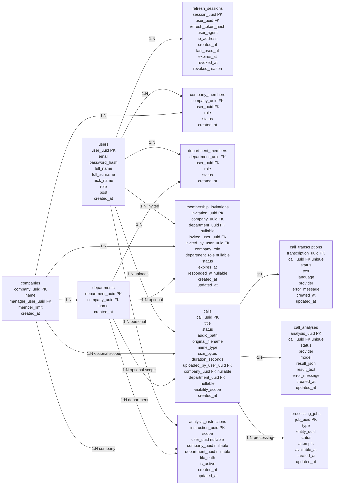
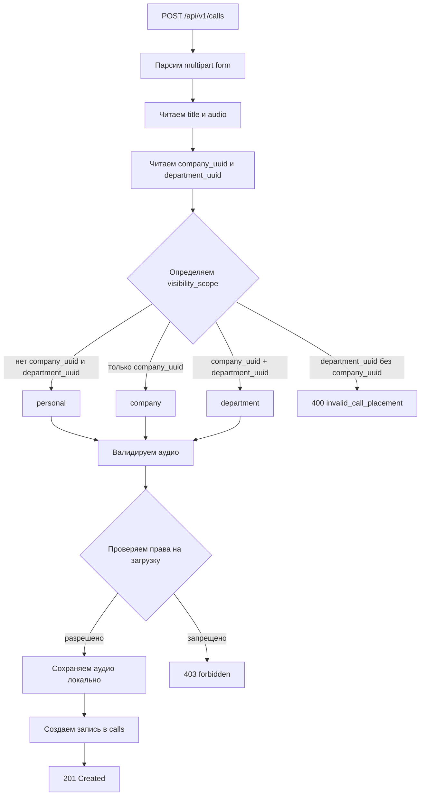
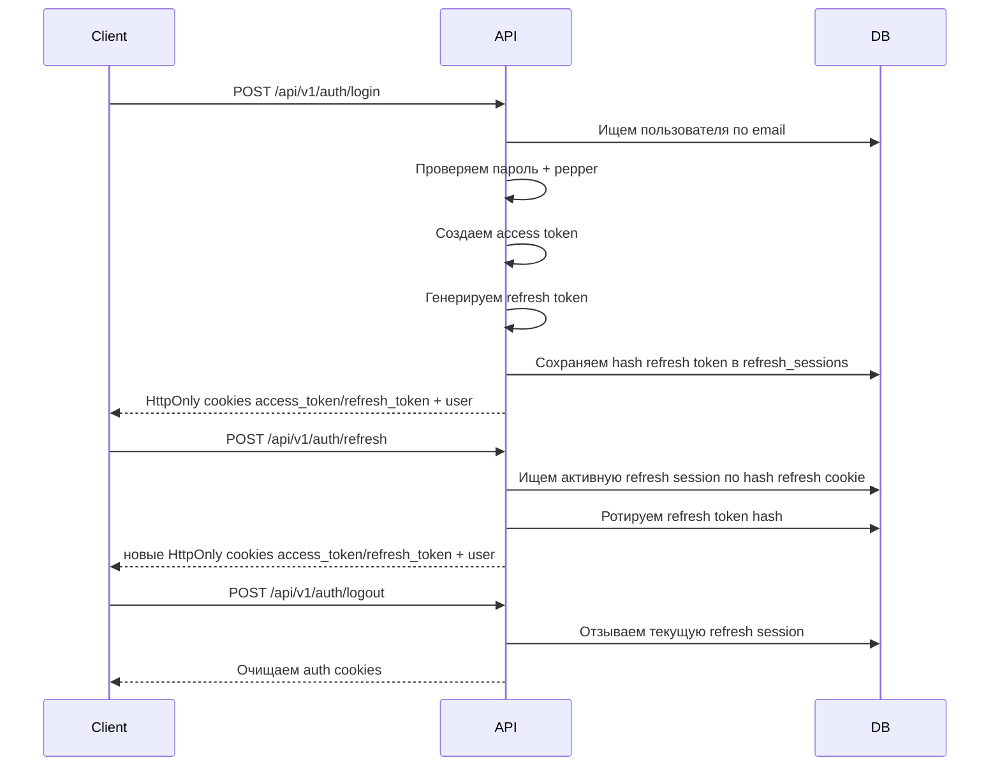

# CallLens Monolith

CallLens - backend-монолит на Go для будущего продукта, который хранит записи звонков продаж/поддержки, транскрибирует аудио и сохраняет результат анализа звонка.

На текущем этапе проект реализует авторизацию, локальную загрузку и хранение аудио, права доступа к звонкам, структуру компаний/отделов, управление участниками, фоновые задания транскрибации, инструкции анализа и mock-анализ звонков по готовой транскрипции.

## Стек

- Go 1.25.7
- PostgreSQL 16
- chi router
- goose migrations
- JWT access tokens
- Refresh sessions в PostgreSQL
- Локальное хранение аудио на файловой системе
- Локальное хранение markdown-инструкций анализа на файловой системе
- Структурированный logger на базе zap
- Docker Compose для локального PostgreSQL

## Текущее состояние

Реализовано:

- Регистрация пользователя.
- Логин пользователя.
- Валидация access token.
- Refresh token rotation.
- Logout и logout-all через отзыв refresh session.
- Ручка текущего пользователя.
- Загрузка звонка с аудиофайлом.
- Проверка типа аудиофайла.
- Определение длительности аудио через `ffprobe`.
- Локальное сохранение аудио.
- Список/получение/скачивание аудио/получение транскрипции/обновление title/удаление звонка.
- Очередь `processing_jobs` и worker для фоновой транскрибации и анализа.
- Абстракция transcriber с mock-провайдером, OpenRouter-провайдером и factory-заглушкой для OpenAI.
- Сохранение транскрипций звонков в `call_transcriptions`.
- Управление markdown-инструкциями анализа для личного, корпоративного и отделского scope.
- Абстракция analyzer с mock-провайдером, OpenRouter-провайдером и factory-заглушкой для OpenAI.
- Асинхронный анализ звонка по готовой транскрипции и инструкциям через `processing_jobs`.
- Ручной запуск анализа через HTTP-ручку по готовой транскрипции.
- Сохранение анализа звонка в `call_analyses`.
- Создание компании.
- Создание отдела.
- Управление участниками компании и отдела.
- Приглашения в компанию и отдел с подтверждением пользователем.
- Ролевая модель доступа к загрузке и просмотру звонков.
- Единый JSON-формат ошибок API.
- Логирование запросов.
- Recovery middleware через общий logger.

Пока не реализовано:

- Реальные OpenAI-провайдеры для transcriber и analyzer.
- Асинхронная очередь для анализа звонков.
- Frontend.
- Оплата и тарифы.
- Email-приглашения.
- Сброс пароля.
- Передача управления компанией другому пользователю.
- Production deploy-конфигурация.

## Основные сущности



## Роли и статусы

Роли в компании:

- `company_manager` - управляющий компанией. Может управлять участниками, отделами и доступом на уровне компании.
- `employee` - обычный участник компании.

Роли в отделе:

- `department_leader` - лидер/руководитель отдела.
- `employee` - обычный участник отдела.

Статусы участников:

- `active`
- `suspended`
- `left`

В проекте для участников используется изменение статуса, а не физическое удаление строки из БД. Это позволяет сохранить историю членства.

Статусы приглашений:

- `pending`
- `accepted`
- `declined`
- `canceled`
- `expired`

## Видимость звонков

У звонка есть поле `visibility_scope`:

- `personal`
- `company`
- `department`

Статусы обработки звонка:

- `new` - звонок сохранён и ожидает обработки.
- `processing` - обработчик забрал звонок в работу.
- `transcribed` - аудио переведено в текст.
- `analyzed` - по транскрипту построен анализ.
- `failed` - обработка завершилась ошибкой.

`new` используется как состояние очереди. Worker забирает задания `transcribe_call`, переводит звонок в `processing`, сохраняет транскрипцию, переводит звонок в `transcribed` и ставит в очередь задание `analyze_call`. Задание анализа загружает готовую транскрипцию, выбирает подходящие инструкции, сохраняет результат в `call_analyses` и при успехе переводит звонок в `analyzed`. HTTP-ручка анализа ставит `analyze_call` job для ручного запуска по готовой транскрипции.

Статусы транскрипции:

- `processing`
- `transcribed`
- `failed`

Статусы анализа:

- `pending`
- `processing`
- `done`
- `failed`

Правила целостности в БД:

- `personal`: `company_uuid` и `department_uuid` должны быть `NULL`.
- `company`: `company_uuid` должен быть заполнен, `department_uuid` должен быть `NULL`.
- `department`: должны быть заполнены и `company_uuid`, и `department_uuid`.

Правила просмотра:

- Пользователь видит звонки, которые сам загрузил.
- `company_manager` видит все звонки своей компании.
- `department_leader` видит звонки своего отдела.
- `employee` видит только свои звонки.

Правила загрузки:

- Любой авторизованный пользователь может загрузить личный звонок.
- Только `company_manager` может загрузить звонок на уровне компании.
- `company_manager`, `department_leader` и `employee` целевого отдела могут загрузить звонок на уровне отдела.



## Авторизация



## Управление участниками

Реализованные операции:

- Добавить участника компании.
- Добавить участника отдела.
- Создать приглашение в компанию.
- Создать приглашение в отдел.
- Получить входящие приглашения текущего пользователя.
- Принять или отклонить приглашение.
- Отменить pending-приглашение.
- Получить структурированный обзор участников компании.
- Получить участников отдела.
- Изменить роль участника компании.
- Изменить статус участника компании.
- Изменить роль участника отдела.
- Изменить статус участника отдела.

Структурированный обзор компании возвращает данные в удобном для frontend виде:

```json
{
  "company_uuid": "...",
  "manager": {
    "company_uuid": "...",
    "user_uuid": "...",
    "role": "company_manager",
    "status": "active",
    "created_at": "..."
  },
  "company_employees": [],
  "departments": [
    {
      "department": {
        "id": "...",
        "company_uuid": "...",
        "name": "Sales",
        "created_at": "..."
      },
      "members": []
    }
  ]
}
```

### Приглашения

Новый flow приглашений не удаляет старые прямые ручки добавления участников. Pending-приглашение не создает `active` membership и не дает доступ к компании или отделу. Пользователь становится активным участником только после `accept`.

Прямое добавление участника отдела доступно `company_manager`; `department_leader` может добавить в свой отдел только уже активного участника компании и только как `employee`.

Права:

- `company_manager` может приглашать пользователя в компанию только как `employee`.
- `company_manager` может приглашать активного участника компании в любой отдел как `employee` или `department_leader`.
- `department_leader` может приглашать только в свой отдел и только как `employee`.

Для MVP выбран консервативный вариант department-invite: лидер отдела может приглашать в отдел только уже активного участника компании. Такой accept не создает `company_members`, поэтому не расширяет права лидера отдела до ввода новых людей в компанию.

Если пользователь был `left` или `suspended` в компании, принятие company-invite реактивирует запись в `company_members` со статусом `active`. Лимит участников компании проверяется на `accept`, а pending invitation не занимает место в лимите.

## API

Базовый путь:

```text
/api/v1
```

Health:

| Method | Path | Auth | Описание |
| --- | --- | --- | --- |
| GET | `/health` | Нет | Проверка состояния API |

Auth:

| Method | Path | Auth | Описание |
| --- | --- | --- | --- |
| POST | `/api/v1/auth/register` | Нет | Регистрация пользователя |
| POST | `/api/v1/auth/login` | Нет | Логин, создание refresh session и установка auth cookies |
| POST | `/api/v1/auth/refresh` | Нет | Ротация refresh token из cookie |
| GET | `/api/v1/auth/me` | Да | Получить текущего пользователя |
| POST | `/api/v1/auth/logout` | Да | Отозвать текущую session |
| POST | `/api/v1/auth/logout-all` | Да | Отозвать все session пользователя |

Calls:

| Method | Path | Auth | Описание |
| --- | --- | --- | --- |
| POST | `/api/v1/calls` | Да | Загрузить аудио звонка |
| GET | `/api/v1/calls` | Да | Получить список видимых звонков |
| GET | `/api/v1/calls/{uuid}` | Да | Получить видимый звонок по UUID |
| GET | `/api/v1/calls/{uuid}/audio` | Да | Получить аудиофайл звонка |
| GET | `/api/v1/calls/{uuid}/transcription` | Да | Получить сохраненную транскрипцию звонка |
| POST | `/api/v1/calls/{uuid}/analysis` | Да | Поставить `analyze_call` job по готовой транскрипции |
| GET | `/api/v1/calls/{uuid}/analysis` | Да | Получить сохраненный анализ звонка |
| PATCH | `/api/v1/calls/{uuid}` | Да | Обновить title звонка |
| DELETE | `/api/v1/calls/{uuid}` | Да | Удалить звонок и аудиофайл |

Analysis instructions:

| Method | Path | Auth | Описание |
| --- | --- | --- | --- |
| POST | `/api/v1/instructions` | Да | Загрузить markdown-инструкцию анализа |
| GET | `/api/v1/instructions` | Да | Получить список активных инструкций по scope |
| GET | `/api/v1/instructions/{uuid}/file` | Да | Скачать файл инструкции |
| DELETE | `/api/v1/instructions/{uuid}` | Да | Деактивировать инструкцию |

Company-инструкции доступны `company_manager` и активным участникам компании, которые уже состоят хотя бы в одном отделе. Активный участник компании без отдела считается находящимся на распределении и не может читать список или файл company-инструкции.

Billing:

| Method | Path | Auth | Описание |
| --- | --- | --- | --- |
| GET | `/api/v1/plans` | Нет | Получить список тарифов |
| GET | `/api/v1/subscription` | Да | Получить активную персональную подписку текущего пользователя |
| POST | `/api/v1/subscription/activate` | Да | Активировать персональную подписку текущего пользователя |
| GET | `/api/v1/companies/{uuid}/subscription` | Да | Получить активную бизнес-подписку компании |
| POST | `/api/v1/companies/{uuid}/subscription/activate` | Да | Активировать бизнес-подписку компании |
| POST | `/api/v1/companies/{uuid}/subscription/cancel` | Да | Отменить бизнес-подписку компании |

Личные звонки и персональные инструкции проверяются по персональной подписке пользователя. Звонки, отделы, участники, приглашения и инструкции компании проверяются по активной бизнес-подписке компании. Бизнес-подписка компании дает персональный бонус только менеджеру этой компании: `business_start` и `business_plus` дают эффективный `personal_plus`, `business_pro` дает эффективный `personal_pro`.

Companies and departments:

| Method | Path | Auth | Описание |
| --- | --- | --- | --- |
| POST | `/api/v1/companies` | Да | Создать компанию |
| GET | `/api/v1/companies` | Да | Получить список компаний пользователя |
| GET | `/api/v1/companies/{uuid}` | Да | Получить компанию |
| GET | `/api/v1/companies/{uuid}/members` | Да | Получить структурированный обзор участников |
| POST | `/api/v1/companies/{uuid}/members` | Да | Добавить участника компании |
| POST | `/api/v1/companies/{uuid}/invitations` | Да | Создать приглашение в компанию |
| POST | `/api/v1/companies/{uuid}/invitations/{invitation_uuid}/cancel` | Да | Отменить приглашение в компанию |
| PATCH | `/api/v1/companies/{uuid}/members/{user_uuid}/role` | Да | Изменить роль участника компании |
| PATCH | `/api/v1/companies/{uuid}/members/{user_uuid}/status` | Да | Изменить статус участника компании |
| POST | `/api/v1/companies/{uuid}/departments` | Да | Создать отдел |
| GET | `/api/v1/companies/{uuid}/departments` | Да | Получить список видимых отделов |
| GET | `/api/v1/companies/{uuid}/departments/{department_uuid}/members` | Да | Получить участников отдела |
| POST | `/api/v1/companies/{uuid}/departments/{department_uuid}/members` | Да | Добавить участника отдела |
| POST | `/api/v1/companies/{uuid}/departments/{department_uuid}/invitations` | Да | Создать приглашение в отдел |
| POST | `/api/v1/companies/{uuid}/departments/{department_uuid}/invitations/{invitation_uuid}/cancel` | Да | Отменить приглашение в отдел |
| PATCH | `/api/v1/companies/{uuid}/departments/{department_uuid}/members/{user_uuid}/role` | Да | Изменить роль участника отдела |
| PATCH | `/api/v1/companies/{uuid}/departments/{department_uuid}/members/{user_uuid}/status` | Да | Изменить статус участника отдела |

Invitations:

| Method | Path | Auth | Описание |
| --- | --- | --- | --- |
| GET | `/api/v1/invitations` | Да | Получить входящие pending-приглашения текущего пользователя |
| GET | `/api/v1/invitations?status=declined` | Да | Получить входящие приглашения с указанным статусом |
| POST | `/api/v1/invitations/{invitation_uuid}/accept` | Да | Принять приглашение |
| POST | `/api/v1/invitations/{invitation_uuid}/decline` | Да | Отклонить приглашение |

## Примеры запросов

Регистрация:

```json
{
  "email": "manager@test.com",
  "password": "Qwerty123!",
  "full_name": "Dmitry",
  "full_surname": "Manager",
  "nick_name": "manager",
  "post": "Manager"
}
```

Логин:

```json
{
  "email": "manager@test.com",
  "password": "Qwerty123!"
}
```

Создание компании:

```json
{
  "name": "CallLens Test Company"
}
```

Создание отдела:

```json
{
  "name": "Sales Department"
}
```

Добавление участника компании:

```json
{
  "user_uuid": "...",
  "role": "employee"
}
```

Добавление участника отдела:

```json
{
  "user_uuid": "...",
  "role": "department_leader"
}
```

Создание приглашения в компанию:

```json
{
  "user_uuid": "...",
  "role": "employee"
}
```

Создание приглашения в отдел:

```json
{
  "user_uuid": "...",
  "role": "department_leader"
}
```

Ответ invitation:

```json
{
  "id": "...",
  "company_uuid": "...",
  "department_uuid": null,
  "invited_user_uuid": "...",
  "invited_by_user_uuid": "...",
  "company_role": "employee",
  "department_role": null,
  "status": "pending",
  "expires_at": "...",
  "responded_at": null,
  "created_at": "...",
  "updated_at": "..."
}
```

Изменение статуса участника:

```json
{
  "status": "suspended"
}
```

Загрузка звонка использует `multipart/form-data`:

```text
title = Test call
audio = File
company_uuid = optional UUID
department_uuid = optional UUID
```

Запуск анализа не требует body и возвращает `202 Accepted` с записью анализа в статусе `pending`:

```text
POST /api/v1/calls/{uuid}/analysis
```

GET анализа возвращает сохраненный результат:

```json
{
  "id": "...",
  "call_uuid": "...",
  "status": "done",
  "provider": "mock",
  "model": null,
  "result_json": {
    "summary": "Mock call analysis"
  },
  "result_text": "Mock call analysis: transcription and instructions were accepted.",
  "error_message": null,
  "created_at": "...",
  "updated_at": "..."
}
```

## Формат ошибок API

Ошибки возвращаются в едином JSON-формате:

```json
{
  "error": {
    "code": "invalid_credentials",
    "message": "invalid credentials"
  }
}
```

## Локальный запуск

1. Скопировать env-файл:

```powershell
Copy-Item .env.example .env
```

2. Запустить PostgreSQL:

```powershell
docker compose up -d
```

3. Запустить API:

```powershell
go run ./cmd
```

4. Проверить health:

```text
http://localhost:8080/health
```

Миграции выполняются при старте приложения из директории `MIGRATION_DIRECTORY`.

## Переменные окружения

Смотри `.env.example`.

Основные переменные:

- `HTTP_HOST`
- `HTTP_PORT`
- `POSTGRES_HOST`
- `POSTGRES_PORT`
- `POSTGRES_DB`
- `POSTGRES_USER`
- `POSTGRES_PASSWORD`
- `MIGRATION_DIRECTORY`
- `UPLOAD_PATH`
- `FFPROBE_PATH`
- `LOG_LEVEL`
- `LOG_AS_JSON`
- `WORKER_ENABLED`
- `WORKER_POLL_INTERVAL`
- `WORKER_LIMIT`
- `WORKER_RETRY_DELAY`
- `WORKER_STALE_AFTER`
- `WORKER_MAX_ATTEMPTS`
- `TRANSCRIBER_PROVIDER`
- `TRANSCRIBER_API_KEY`
- `TRANSCRIBER_MODEL`
- `ANALYZER_PROVIDER`
- `ANALYZER_API_KEY`
- `ANALYZER_MODEL`

Для анализа через OpenRouter рекомендуется недорогая модель `mistralai/mistral-nemo`: она подходит для русских звонков, поддерживает структурированные JSON-ответы и не использует более строгие лимиты `:free` моделей.

- `PASSWORD_PEPPER`
- `JWT_SECRET`
- `JWT_ACCESS_TOKEN_TTL`
- `REFRESH_TOKEN_SECRET`
- `REFRESH_TOKEN_TTL`

## Структура проекта

```text
cmd/                        Точка входа приложения
internal/API/               HTTP handlers, DTO, response helpers
internal/analyzer/          Абстракция и mock-провайдер анализа
internal/auth/              Password, token, refresh helpers
internal/config/            Конфигурация из env
internal/converter/         Конвертеры domain -> API
internal/httpserver/        Router и HTTP middleware
internal/logger/            Logger приложения
internal/migrator/          Обертка над goose migrator
internal/models/            Доменные модели
internal/repository/        PostgreSQL repositories
internal/service/           Бизнес-логика
internal/storage/audio/     Локальное хранение аудио
internal/storage/instruction/ Локальное хранение markdown-инструкций
internal/transcriber/       Абстракция и mock-провайдер транскрибации
migrations/                 SQL-миграции goose
```

## Ближайшие шаги разработки

Рекомендуемый порядок:

1. Вручную проверить сценарии membership и visibility через Postman.
2. Добавить тесты для repository/service/API анализа звонков.
3. Добавить реальные OpenAI-провайдеры для transcriber и analyzer.
4. Начать frontend после стабилизации backend workflows.
