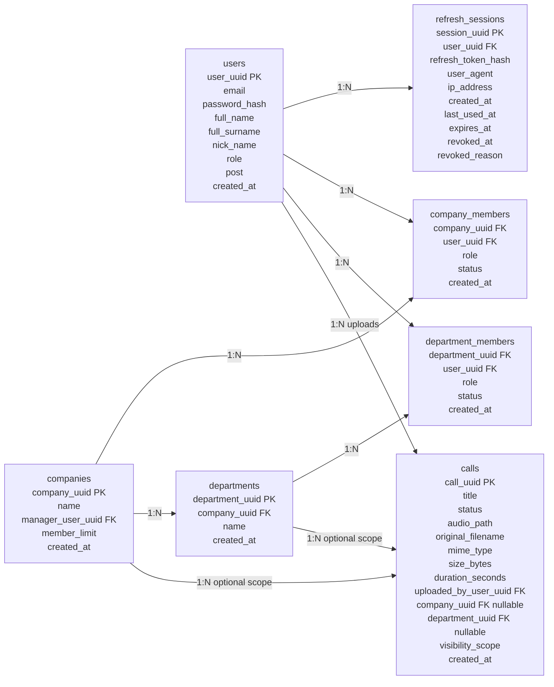
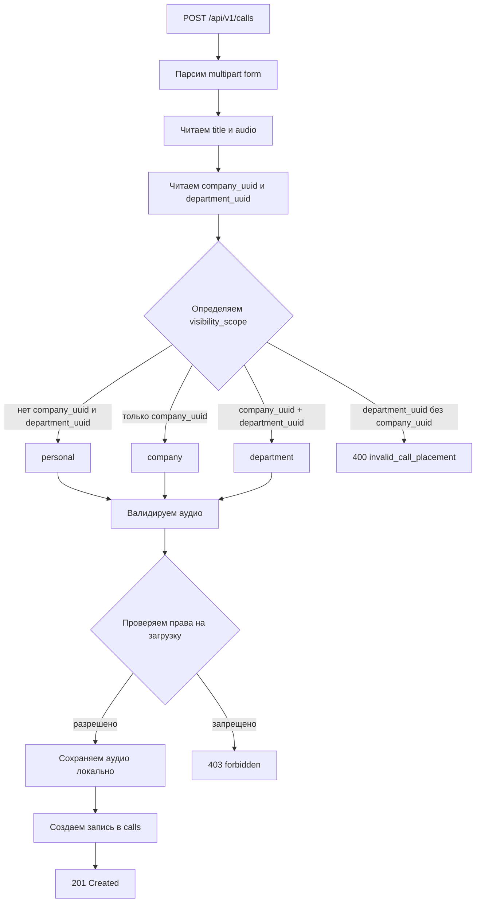
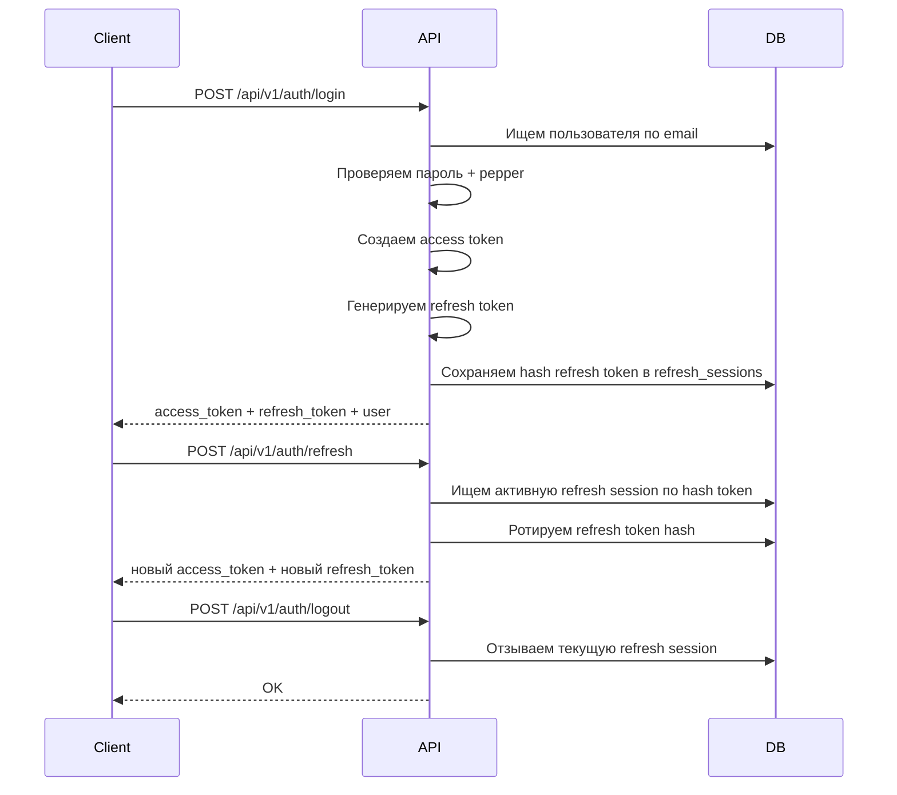

# CallLens Monolith

CallLens - backend-монолит на Go для будущего продукта, который хранит записи звонков продаж/поддержки и готовит основу для транскрибации и AI-анализа.

На текущем этапе проект реализует авторизацию, локальную загрузку и хранение аудио, права доступа к звонкам, структуру компаний/отделов и управление участниками.

## Стек

- Go 1.25.7
- PostgreSQL 16
- chi router
- goose migrations
- JWT access tokens
- Refresh sessions в PostgreSQL
- Локальное хранение аудио на файловой системе
- Структурированный logger на базе zap
- Docker Compose для локального PostgreSQL

## Текущее состояние

Реализовано:

- Регистрация пользователя.
- Логин пользователя.
- Валидация access token.
- Refresh token rotation.
- Logout и logout-all через отзыв refresh session.
- Ручка текущего пользователя.
- Загрузка звонка с аудиофайлом.
- Проверка типа аудиофайла.
- Локальное сохранение аудио.
- Список/получение/скачивание аудио/обновление title/удаление звонка.
- Создание компании.
- Создание отдела.
- Управление участниками компании и отдела.
- Ролевая модель доступа к загрузке и просмотру звонков.
- Единый JSON-формат ошибок API.
- Логирование запросов.
- Recovery middleware через общий logger.

Пока не реализовано:

- Транскрибация аудио.
- AI-анализ звонков.
- Frontend.
- Оплата и тарифы.
- Email-приглашения.
- Сброс пароля.
- Передача управления компанией другому пользователю.
- Production deploy-конфигурация.

## Основные сущности



## Роли и статусы

Роли в компании:

- `company_manager` - управляющий компанией. Может управлять участниками, отделами и доступом на уровне компании.
- `employee` - обычный участник компании.

Роли в отделе:

- `department_leader` - лидер/руководитель отдела.
- `employee` - обычный участник отдела.

Статусы участников:

- `active`
- `suspended`
- `left`

В проекте для участников используется изменение статуса, а не физическое удаление строки из БД. Это позволяет сохранить историю членства.

## Видимость звонков

У звонка есть поле `visibility_scope`:

- `personal`
- `company`
- `department`

Правила целостности в БД:

- `personal`: `company_uuid` и `department_uuid` должны быть `NULL`.
- `company`: `company_uuid` должен быть заполнен, `department_uuid` должен быть `NULL`.
- `department`: должны быть заполнены и `company_uuid`, и `department_uuid`.

Правила просмотра:

- Пользователь видит звонки, которые сам загрузил.
- `company_manager` видит все звонки своей компании.
- `department_leader` видит звонки своего отдела.
- `employee` видит только свои звонки.

Правила загрузки:

- Любой авторизованный пользователь может загрузить личный звонок.
- Только `company_manager` может загрузить звонок на уровне компании.
- `company_manager`, `department_leader` и `employee` целевого отдела могут загрузить звонок на уровне отдела.



## Авторизация



## Управление участниками

Реализованные операции:

- Добавить участника компании.
- Добавить участника отдела.
- Получить структурированный обзор участников компании.
- Получить участников отдела.
- Изменить роль участника компании.
- Изменить статус участника компании.
- Изменить роль участника отдела.
- Изменить статус участника отдела.

Структурированный обзор компании возвращает данные в удобном для frontend виде:

```json
{
  "company_uuid": "...",
  "manager": {
    "company_uuid": "...",
    "user_uuid": "...",
    "role": "company_manager",
    "status": "active",
    "created_at": "..."
  },
  "company_employees": [],
  "departments": [
    {
      "department": {
        "id": "...",
        "company_uuid": "...",
        "name": "Sales",
        "created_at": "..."
      },
      "members": []
    }
  ]
}
```

## API

Базовый путь:

```text
/api/v1
```

Health:

| Method | Path | Auth | Описание |
| --- | --- | --- | --- |
| GET | `/health` | Нет | Проверка состояния API |

Auth:

| Method | Path | Auth | Описание |
| --- | --- | --- | --- |
| POST | `/api/v1/auth/register` | Нет | Регистрация пользователя |
| POST | `/api/v1/auth/login` | Нет | Логин и создание refresh session |
| POST | `/api/v1/auth/refresh` | Нет | Ротация refresh token |
| GET | `/api/v1/auth/me` | Да | Получить текущего пользователя |
| POST | `/api/v1/auth/logout` | Да | Отозвать текущую session |
| POST | `/api/v1/auth/logout-all` | Да | Отозвать все session пользователя |

Calls:

| Method | Path | Auth | Описание |
| --- | --- | --- | --- |
| POST | `/api/v1/calls` | Да | Загрузить аудио звонка |
| GET | `/api/v1/calls` | Да | Получить список видимых звонков |
| GET | `/api/v1/calls/{uuid}` | Да | Получить видимый звонок по UUID |
| GET | `/api/v1/calls/{uuid}/audio` | Да | Получить аудиофайл звонка |
| PATCH | `/api/v1/calls/{uuid}` | Да | Обновить title звонка |
| DELETE | `/api/v1/calls/{uuid}` | Да | Удалить звонок и аудиофайл |

Companies and departments:

| Method | Path | Auth | Описание |
| --- | --- | --- | --- |
| POST | `/api/v1/companies` | Да | Создать компанию |
| GET | `/api/v1/companies` | Да | Получить список компаний пользователя |
| GET | `/api/v1/companies/{uuid}` | Да | Получить компанию |
| GET | `/api/v1/companies/{uuid}/members` | Да | Получить структурированный обзор участников |
| POST | `/api/v1/companies/{uuid}/members` | Да | Добавить участника компании |
| PATCH | `/api/v1/companies/{uuid}/members/{user_uuid}/role` | Да | Изменить роль участника компании |
| PATCH | `/api/v1/companies/{uuid}/members/{user_uuid}/status` | Да | Изменить статус участника компании |
| POST | `/api/v1/companies/{uuid}/departments` | Да | Создать отдел |
| GET | `/api/v1/companies/{uuid}/departments` | Да | Получить список видимых отделов |
| GET | `/api/v1/companies/{uuid}/departments/{department_uuid}/members` | Да | Получить участников отдела |
| POST | `/api/v1/companies/{uuid}/departments/{department_uuid}/members` | Да | Добавить участника отдела |
| PATCH | `/api/v1/companies/{uuid}/departments/{department_uuid}/members/{user_uuid}/role` | Да | Изменить роль участника отдела |
| PATCH | `/api/v1/companies/{uuid}/departments/{department_uuid}/members/{user_uuid}/status` | Да | Изменить статус участника отдела |

## Примеры запросов

Регистрация:

```json
{
  "email": "manager@test.com",
  "password": "Qwerty123!",
  "full_name": "Dmitry",
  "full_surname": "Manager",
  "nick_name": "manager",
  "post": "Manager"
}
```

Логин:

```json
{
  "email": "manager@test.com",
  "password": "Qwerty123!"
}
```

Создание компании:

```json
{
  "name": "CallLens Test Company"
}
```

Создание отдела:

```json
{
  "name": "Sales Department"
}
```

Добавление участника компании:

```json
{
  "user_uuid": "...",
  "role": "employee"
}
```

Добавление участника отдела:

```json
{
  "user_uuid": "...",
  "role": "department_leader"
}
```

Изменение статуса участника:

```json
{
  "status": "suspended"
}
```

Загрузка звонка использует `multipart/form-data`:

```text
title = Test call
audio = File
company_uuid = optional UUID
department_uuid = optional UUID
```

## Формат ошибок API

Ошибки возвращаются в едином JSON-формате:

```json
{
  "error": {
    "code": "invalid_credentials",
    "message": "invalid credentials"
  }
}
```

## Локальный запуск

1. Скопировать env-файл:

```powershell
Copy-Item .env.example .env
```

2. Запустить PostgreSQL:

```powershell
docker compose up -d
```

3. Запустить API:

```powershell
go run ./cmd/api
```

4. Проверить health:

```text
http://localhost:8080/health
```

Миграции выполняются при старте приложения из директории `MIGRATION_DIRECTORY`.

## Переменные окружения

Смотри `.env.example`.

Основные переменные:

- `HTTP_HOST`
- `HTTP_PORT`
- `POSTGRES_HOST`
- `POSTGRES_PORT`
- `POSTGRES_DB`
- `POSTGRES_USER`
- `POSTGRES_PASSWORD`
- `MIGRATION_DIRECTORY`
- `UPLOAD_PATH`
- `LOG_LEVEL`
- `LOG_AS_JSON`
- `PASSWORD_PEPPER`
- `JWT_SECRET`
- `JWT_ACCESS_TOKEN_TTL`
- `REFRESH_TOKEN_SECRET`
- `REFRESH_TOKEN_TTL`

## Структура проекта

```text
cmd/api/                    Точка входа приложения
internal/API/               HTTP handlers, DTO, response helpers
internal/auth/              Password, token, refresh helpers
internal/config/            Конфигурация из env
internal/converter/         Конвертеры domain -> API
internal/httpserver/        Router и HTTP middleware
internal/logger/            Logger приложения
internal/migrator/          Обертка над goose migrator
internal/models/            Доменные модели
internal/repository/        PostgreSQL repositories
internal/service/           Бизнес-логика
internal/storage/audio/     Локальное хранение аудио
migrations/                 SQL-миграции goose
```

## Ближайшие шаги разработки

Рекомендуемый порядок:

1. Вручную проверить сценарии membership и visibility через Postman.
2. Добавить тесты на правила доступа и repository-запросы.
3. Добавить процессинг статусов для транскрибации.
4. Добавить abstraction для провайдера транскрибации.
5. Добавить сущности и endpoints для AI-анализа.
6. Начать frontend после стабилизации backend workflows.
